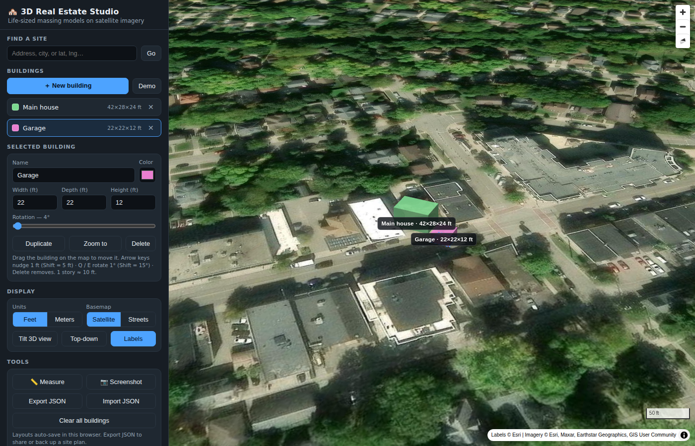

# 3D Real Estate Studio 🏘️

Create **life-sized 3D models of real estate** and place them on a **satellite map** to see exactly how they'd look and line up on a real site.

Everything runs in a single `index.html` — no build step, no API keys, no server-side code. Perfect for dropping into a display hub, GitHub Pages, or any static host.



## What it does

- **True-to-scale buildings** — enter width × depth × height in **feet or meters** and the model renders at exactly that size on the map (heights are real meters in the 3D engine; footprints are computed from geodetic meters-per-degree at the site's latitude).
- **Satellite basemap** — free Esri World Imagery, with an OpenStreetMap streets basemap as an alternate and an optional place-labels overlay.
- **Full 3D view** — tilt, rotate, and orbit the camera around your massing models; one-click top-down view for lining footprints up with lot lines.
- **Direct manipulation** — drag buildings on the map, rotate with a slider or `Q`/`E`, nudge foot-by-foot with arrow keys.
- **Measuring tape** — click points on the map to measure distances (setbacks, lot widths) in your chosen units.
- **Address search** — jump to any address via OpenStreetMap's Nominatim geocoder, or paste `lat, lng` coordinates directly.
- **Persistence** — layouts auto-save to the browser (localStorage), and you can export/import site plans as JSON to share them.
- **Screenshots** — one-click PNG export of the current view for listings, decks, or your display hub.

## Run it

Open `index.html` in a browser. That's it.

If your browser restricts `file://` pages, serve it locally:

```bash
python3 -m http.server 8000
# then open http://localhost:8000
```

### Deploy to GitHub Pages

1. Push this repo to GitHub.
2. **Settings → Pages → Source: Deploy from a branch**, pick your branch and `/ (root)`.
3. Your studio is live at `https://<user>.github.io/<repo>/`.

## Using the studio

1. **Find your site** — search an address (or `lat, lng`) in the top-left box.
2. **Place a building** — click **＋ New building**, then click the map. A default 40×30×22 ft house drops in.
3. **Size it for real** — with the building selected, type its true width/depth/height. `1 story ≈ 10 ft`.
4. **Line it up** — drag it into place over the satellite photo; rotate it to match the street or lot lines; use **📏 Measure** to check setbacks.
5. **Show it off** — tilt into 3D, take a **📷 Screenshot**, or **Export JSON** to share the plan.

### Keyboard shortcuts

| Key | Action |
| --- | --- |
| Arrow keys | Nudge selected building 1 ft (Shift = 5 ft) |
| `Q` / `E` | Rotate 1° counter-/clockwise (Shift = 15°) |
| `Delete` | Remove selected building |
| `Esc` | Cancel placement / measuring |

## Accuracy notes

- Footprint geometry uses the standard geodetic meters-per-degree series at the building's latitude, so dimensions are accurate to well under 1% at building scale, anywhere on Earth.
- Extrusion heights are true meters (MapLibre's `fill-extrusion-height` is defined in meters).
- The ground is treated as flat — on steep sites the base of the model follows the map plane, not the terrain.
- Buildings are flat-roofed massing volumes (the standard for zoning/fit studies). Gabled roofs are a possible future addition.

## Data & attribution

| Service | Use | Terms |
| --- | --- | --- |
| [Esri World Imagery](https://www.arcgis.com/home/item.html?id=10df2279f9684e4a9f6a7f08febac2a9) | Satellite basemap | Free with attribution (shown on-map) |
| [OpenStreetMap](https://www.openstreetmap.org/copyright) | Streets basemap | ODbL, attribution shown on-map |
| [Nominatim](https://operations.osmfoundation.org/policies/nominatim/) | Address search | Light interactive use only — no bulk geocoding |
| [MapLibre GL JS](https://maplibre.org/) | Map engine (CDN) | BSD-3-Clause |

## Tech

Single-file vanilla JS + [MapLibre GL JS](https://maplibre.org/) v4. Buildings live in a GeoJSON source rendered with a `fill-extrusion` layer; all state is plain JSON (meters internally, converted at the UI edge).
