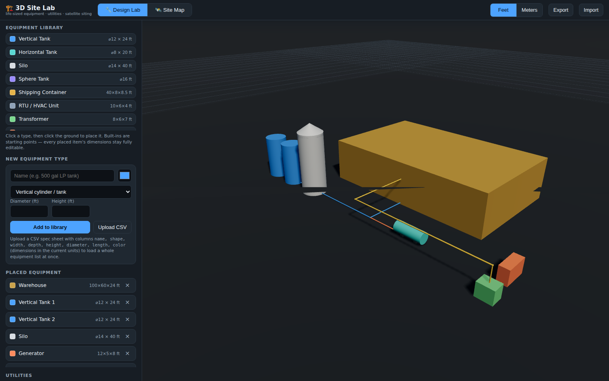
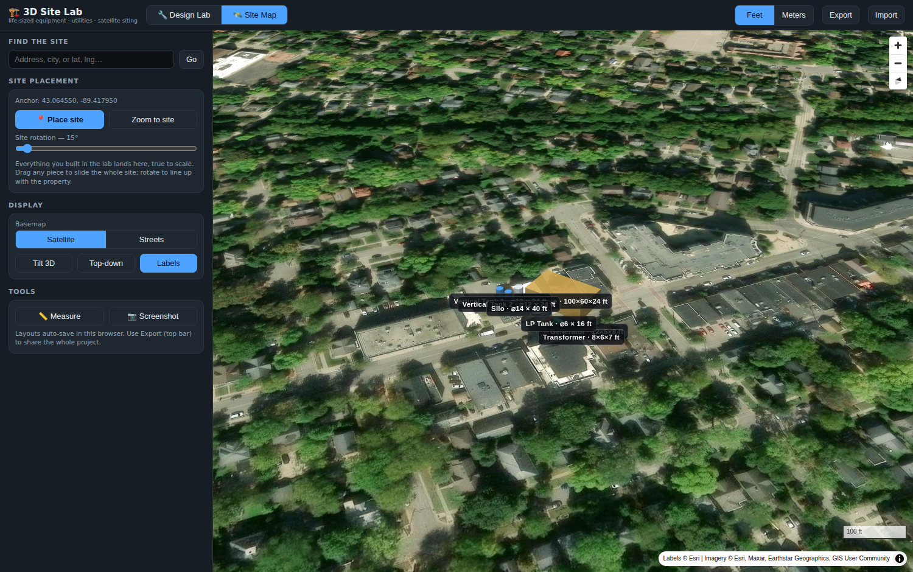

# 3D Site Lab 🏗️

A **3D rendering lab for commercial sites**: define equipment with real-world dimensions (including diameters for tanks and silos), assemble the facility in a full 3D scene, wire up the utilities between equipment — then drop the whole site onto a **satellite map** to see exactly how it looks and lines up on the actual property.

Desktop-first, static files only — no build step, no API keys, no server. Drop it on GitHub Pages or any display hub that allows outbound requests.

| Design Lab | Site Map |
| --- | --- |
|  |  |

## Two modes, one project

### 🔧 Design Lab (three.js)

- **Equipment with real dimensions** — vertical/horizontal cylinders and tanks (defined by **diameter**), silos with cone roofs, spheres on legs, and boxes for buildings, skids, containers, transformers, generators, and anything else. Everything is stored in meters and rendered at exactly that size.
- **Build your library** — 12 built-in commercial templates, a form for custom types, or **upload a CSV spec sheet** (`name, shape, width, depth, height, diameter, length, color`) to load a whole equipment list at once.
- **Direct manipulation** — click to place, drag on the ground to move (with grid snap), rotate with a slider or `Q`/`E`, nudge with arrow keys, `Ctrl+D` to duplicate.
- **Utilities** — connect any two pieces of equipment with color-coded runs: **electric, water, gas, sewer, data, steam**, routed at ground level or overhead, with run lengths reported in your units.
- **Real graphics** — soft shadows, sky, tone-mapped materials, orbit/pan/zoom camera, and a draggable 6 ft scale figure so sizes always read correctly.

### 🛰️ Site Map (MapLibre + Esri satellite imagery)

- Search an address (or paste `lat, lng`), click **Place site**, and everything you built in the lab lands on the satellite photo **true to scale** — extruded to its real height, utilities drawn as colored lines.
- Drag any piece to slide the whole site; rotate the site to line up with lot lines and existing structures.
- Measuring tape for setbacks, tilt/top-down views, streets basemap, PNG screenshots with labels and imagery credits composited in.

Both modes share one project: **auto-saved** in the browser, **exportable as JSON** to share or back up.

## Run it

Serve the folder over HTTP (ES modules don't load from `file://`):

```bash
python3 -m http.server 8000
# open http://localhost:8000
```

### Deploy to GitHub Pages

**Settings → Pages → Source: Deploy from a branch** → pick the branch and `/ (root)`. Done — it's a fully static site.

## Keyboard shortcuts (lab)

| Key | Action |
| --- | --- |
| Arrow keys | Nudge selected item (Shift = 5×) |
| `Q` / `E` | Rotate 15° (Shift = 1° fine) |
| `Ctrl+D` | Duplicate selected |
| `Delete` | Remove selected |
| `Esc` | Cancel place/connect mode |

## CSV equipment import

Columns (any order, case-insensitive): `name, shape, width, depth, height, diameter, length, color`. Dimensions are read in the **currently selected units**. Shapes: `box`, `cylinder` (vertical), `horizontal`, `silo`, `sphere`.

```csv
name,shape,width,depth,height,diameter,length,color
30k gal Tank,cylinder,,,32,16,,#4da3ff
LP Tank,horizontal,,,,6,16,#5ad7d2
Control Skid,box,12,8,9,,,#e4b34a
```

## Accuracy notes

- Site-to-map georeferencing uses the WGS84 geodetic meters-per-degree series at the site's latitude — verified against an independent ellipsoidal distance formula to within centimeters at site scale.
- Map extrusion heights are true meters; lab and map use the same rotation convention (degrees clockwise from north), so nothing mirrors or skews between modes.
- The ground is treated as flat in both modes.

## Data & attribution

| Service | Use | Terms |
| --- | --- | --- |
| [Esri World Imagery](https://www.arcgis.com/home/item.html?id=10df2279f9684e4a9f6a7f08febac2a9) | Satellite basemap | Free with attribution (shown on-map) |
| [OpenStreetMap](https://www.openstreetmap.org/copyright) | Streets basemap | ODbL, attribution shown on-map |
| [Nominatim](https://operations.osmfoundation.org/policies/nominatim/) | Address search | Light interactive use only |
| [three.js](https://threejs.org/) r160 | 3D lab renderer (CDN) | MIT |
| [MapLibre GL JS](https://maplibre.org/) v4 | Map engine (CDN) | BSD-3-Clause |

## Architecture

Vanilla ES modules, no framework:

```
index.html      shell: top bar, two mode roots, importmap
css/style.css   dark UI theme
js/state.js     data model (meters), geodesy, persistence, CSV import
js/lab.js       three.js scene: equipment meshes, utilities, picking
js/map.js       MapLibre site view: extrusions, site anchor, measure
js/main.js      mode switching, panels, project I/O, keyboard routing
```
