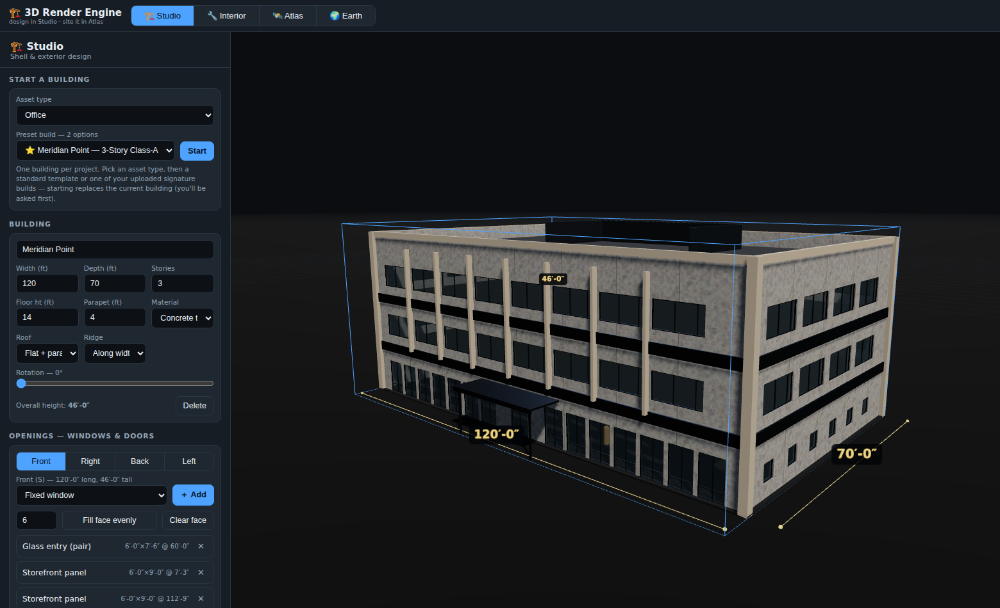
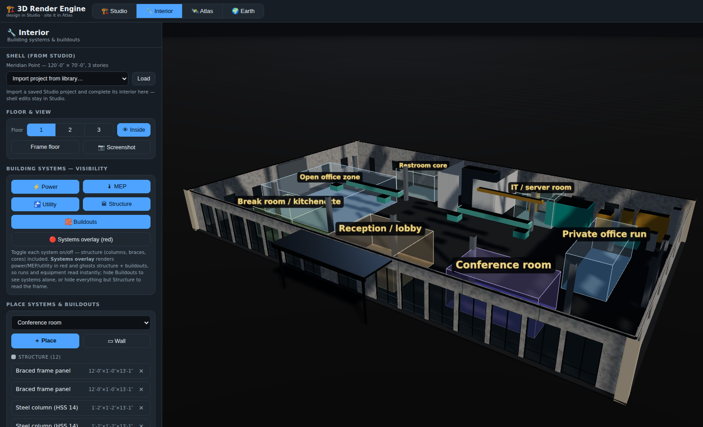
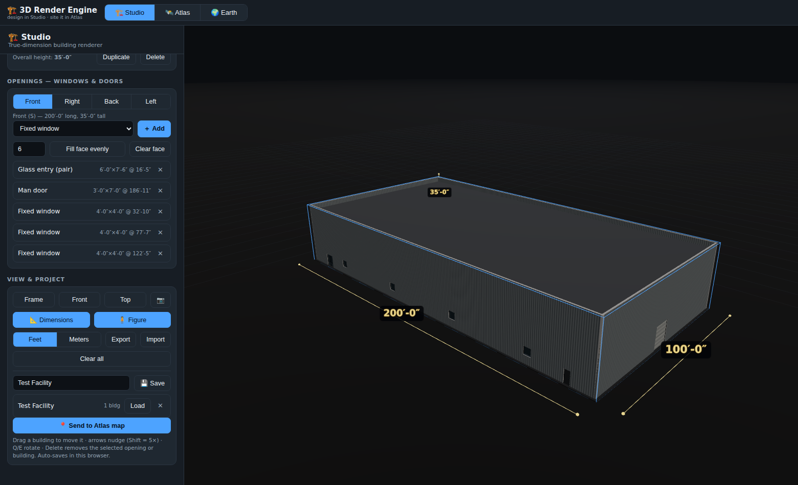
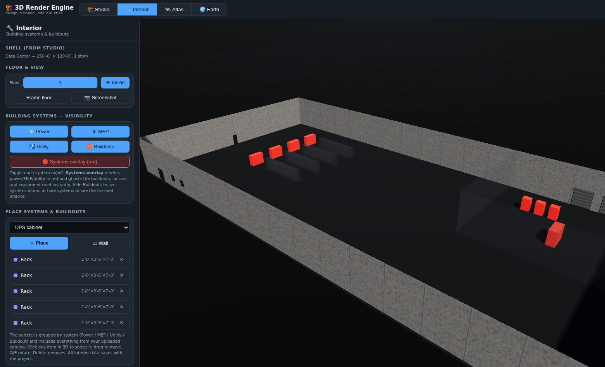
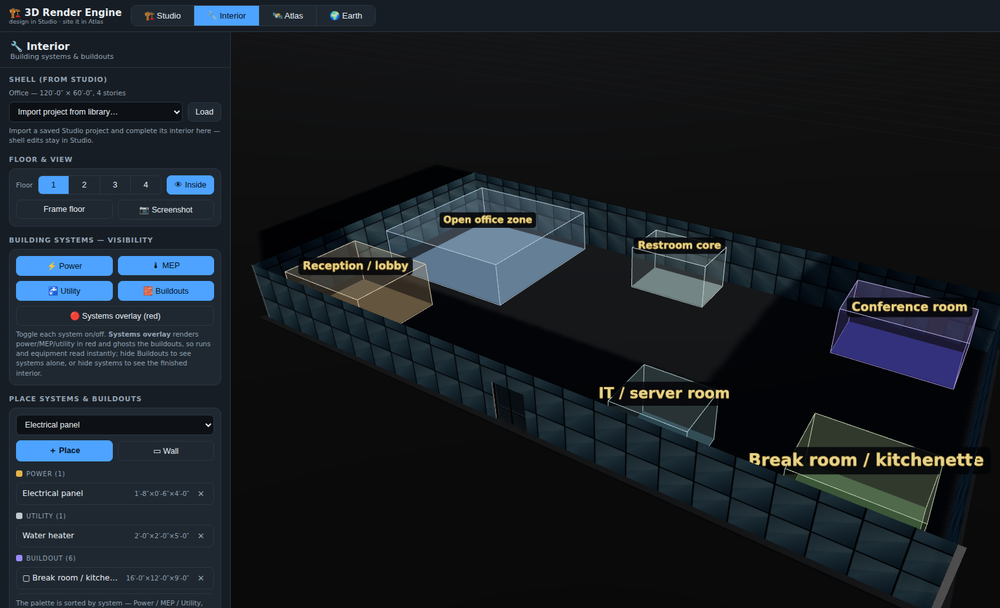
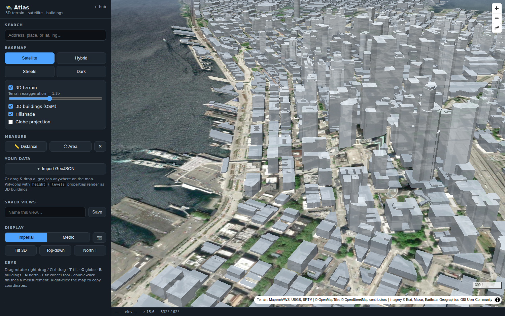

# 3D Render Engine — Studio · Interior · Atlas · Earth

**One engine, four tabs.** Design a true-dimension building shell in **🏗️ Studio**, fit out its **🔧 Interior** — structure, power, utility, and MEP systems with a red systems-overlay view — then place the project at real scale on the **🛰️ Atlas** satellite map, or fly it in photorealistic **🌍 Earth**. Desktop-only, static files, no build step, **no API keys required** (Earth is the one opt-in exception).

## ⭐ The signature build — Meridian Point

Pick **Office → ⭐ Meridian Point** in Studio and one click delivers a fully developed, presentation-ready project: a 120′ × 70′ three-story Class-A office with an articulated facade — storefront base with a glass entry under a steel canopy, six-foot ribbon glass above, spandrel bands at every floor line, vertical fins, corner piers, a cornice cap, and a rooftop mechanical screen (the articulation re-derives itself when you edit the plan in Studio). Inside: **110 elements** across three floors and the roof — a steel column grid with braced frames, elevator/stair core, ceiling-hung ducts, VAV boxes and busway at real mounting heights, a complete Level-1 electrical/fire/plumbing lineup (switchboard, ATS, transformer, riser, backflow, water heater, AHU), labeled buildout zones on every floor, and two RTUs + exhaust fans on the roof inside the screen (selecting roof gear drops the cutaway automatically so it's never invisible). Every system — **Structure, Power, MEP, Utility, Buildouts** — toggles on and off, and the red overlay makes the engineering read instantly.

| ⭐ Meridian Point — shell | ⭐ Meridian Point — Level 1 |
| --- | --- |
|  |  |

## The workflow

1. **🏗️ Studio — shell & exterior.** One building per project. Pick an **asset type** (Multifamily, Retail, Office, Industrial, Data Center) from a dropdown, then a **preset build** — the standard template for that class, or one of your own uploaded signature builds — and hit Start. Control every dimension, material, roof, window, and door.
2. **🔧 Interior — building systems & buildouts.** The shell comes straight from Studio (read-only here). Pick a floor, place equipment and draw partition walls; every element is classified into a building system — **Power / MEP / Utility / Buildout** — that you can show, hide, or flash **red** as a systems overlay.
3. **💾 Save** — projects go to a library shared by every tab (and auto-persist in the browser).
4. **📍 Send to Atlas map** — the engine switches tabs and arms placement; click the map and your project lands as true-scale 3D massing. Drag to move it, rotate it to sit the lot, place as many saved projects as you like.
5. **🌍 Earth** — paste a Google Map Tiles API key and the same placed sites render over photorealistic 3D photogrammetry.

| 🏗️ Studio | 🔧 Interior — systems overlay |
| --- | --- |
|  |  |

| 🔧 Interior — buildout spaces | 🛰️ Atlas |
| --- | --- |
|  |  |

---

## 🏗️ Studio — shell & exterior

A black-space design studio where **nothing is left to guess**:

- **Start a building** — asset-type dropdown → preset dropdown. Only the presets for the selected asset class are shown: its standard template plus any **signature builds you've uploaded** to the catalog. One building per project; starting a new one asks before replacing.
- **True-dimension envelopes** — width/depth, story count × floor height, flat roof with parapet or gable with real pitch (rise:12) and ridge direction. Overall height reported in feet-inches.
- **Real material textures at true pattern scale** — brick renders with modular courses at actual 8" × 2⅔" spacing; CMU at 16"×8"; concrete tilt-up with 15 ft panel reveals; metal panel with 12" ribs; curtainwall with 5 ft mullion grid; EIFS; 6" lap siding. Pattern size is exact because texture repeat is computed from wall meters.
- **Openings are components** — windows and doors are first-class objects on each face: pick the **type** (fixed, double-hung, sliding, picture, storefront, ribbon, glass entry, man door, overhead door, dock door — each with real default sizes), then control **width, height, sill height, and position** to the inch. Walls get real holes; glass, frames, and mullions render per type. Click any window in 3D to select and edit it.
- **Fast fenestration** — "Fill face evenly" arrays any type across a face; misfit/overlapping openings are flagged, never silently drawn wrong.
- **Dimension annotations** — toggleable 3D dimension lines with feet-inch labels, a draggable 6 ft scale figure, framed/front/top cameras, PNG screenshots.
- **Projects** — one building per project; auto-save, JSON export/import (foreign files are rejected, never wipe your work).

## 🔧 Interior — building systems & buildouts

Everything inside the building lives here; the shell is Studio's and arrives automatically:

- **Import from the library** — pull any saved Studio project straight into this tab and complete its interior, without touching the shell (shell edits stay in Studio; Studio resyncs when you switch back).
- **Systems classification** — every placed element belongs to **🏛 Structure** (steel/concrete columns, girders, bar joists, braced frames, stairs), **⚡ Power** (transformers, switchboards, generators, ATS, busway, BESS, panels, IDF…), **🌡 MEP** (RTUs, AHUs, VAV boxes, fan coils, ERV/DOAS, chillers, cooling towers, boilers, pump skids, duct runs…), **🚰 Utility** (fire pumps, sprinkler risers, backflow, boosters, compressors, water heaters…), or **🧱 Buildout** (workstations, gondolas, kitchen lines, walk-ins, lockers, racking, partitions…). ~60 built-in types with real dimensions across every property class, and uploaded catalog equipment is classified automatically by type and name.
- **Real mounting heights** — ceiling-hung gear (VAV boxes, fan coils, duct runs, busway, girders, bar joists) renders at its actual elevation above the floor, and rooftop plant sits on the roof.
- **High-level buildout spaces** — generic, unbranded room-scale zones that rough in what a buildout would look like: open office zone, private office run, conference room, reception/lobby, break room, restroom core, IT room, fitting rooms, checkout run, back-of-house storage, amenity lounge, fitness room, residential unit. They render as labeled translucent volumes with a floor pad so the plan reads at a glance, and they drag/resize/rotate like everything else.
- **Sorted everywhere** — the palette is grouped Power / MEP / Utility / **Buildout — spaces** / **Buildout — fixtures & equipment**, alphabetized within each group; the placed-items list is grouped by system with headers and counts (spaces first, then fixtures, walls last).
- **Visibility per system** — four toggle buttons show/hide each system independently: hide Buildouts to see the systems alone, or hide systems to see the finished interior.
- **🔴 Systems overlay** — one switch renders every Power/MEP/Utility element in **red** and ghosts the buildouts to 18% grey, so equipment runs and electrical/mechanical rooms read instantly.
- **Floor-by-floor doll-house** — floor chips + an Inside view (on by default) slice the building open above the active floor. Place equipment with real dimensions on the floor plane, draw partition walls with two clicks, then click any element in 3D to select it; drag, arrow-key nudge, rotate (Q/E), resize, delete. Zoom runs from site-wide right down to arm's length from a cabinet, in Studio and Interior both.
- **Palette + your data** — built-in equipment (racks, CRAC/CRAH, UPS, PDUs, switchgear, panels, pallet racking, machines…) plus everything you upload. The Data Center template ships with a full rack/CRAC/electrical-room layout to explore.

### Your data — the catalog the system adapts to

Studio's catalog upload (CSV or exported JSON) feeds every picker in the engine. One file, three kinds of rows:

```csv
kind,name,brand,type,width,depth,height,sill,color,stories,floorheight,parapet,material
equipment,Chiller X90,Trane,chiller,8,4,6,,#5ad7d2,,,,
opening,ProLine 4x6,Pella,double-hung,4,,6,2.5,#ffffff,,,,
preset,Flex Warehouse 40k,,industrial,400,100,,,,1,28,3,metal
```

- `equipment` rows join the **Interior palette**, auto-classified into their building system.
- `opening` rows join the **windows & doors picker** as products with real sizes (`type` maps to a base type: window, double-hung, sliding, storefront, door, overhead, dock…).
- `preset` rows join the **preset build dropdown** under their asset class (`type`: multifamily/retail/office/industrial/datacenter) as signature builds.

Dimensions are read in the current units; entries persist in the browser and export/import as JSON. A ready-made starter is in `data/`: **`catalog-seed.csv`** (559 rows of real-world equipment, opening products, and developer signature builds) generated from the reference workbook **`building-systems-catalog.xlsx`**.

---

## 🛰️ Atlas — the mapping tab

A serious 3D mapping platform (MapLibre GL v5):

- **3D terrain** — real global elevation (AWS/Mapzen terrarium DEM) with adjustable exaggeration and hillshading.
- **Satellite / aerial imagery** — Esri World Imagery, plus Hybrid (labels + roads), Streets, and Dark basemaps.
- **Real 3D buildings** — OSM building massing with true heights, extruded from OpenFreeMap vector tiles, worldwide.
- **Globe projection** toggle, smooth tilt/rotate camera, saved named views.
- **Search** — autocomplete geocoding (Photon/komoot) or paste `lat, lng` directly.
- **Measuring** — distance and area tools (imperial/metric: ft/mi, sq ft/acres).
- **Bring your own data** — drag-and-drop GeoJSON. Polygons carrying `height` (meters) or `levels`/`stories` properties render instantly as 3D buildings; per-layer color, opacity, zoom-to, remove.
- **Status bar** — live cursor coordinates, ground elevation, zoom, camera bearing/pitch. Right-click → copy coordinates, measure from here.
- **PNG screenshots** with imagery credits and measurement labels baked in.

## 🌍 Earth — photorealistic 3D

Google-Earth-grade visuals, opt-in with your own key:

- Paste a **Google Map Tiles API key** and the tab streams **Photorealistic 3D Tiles** — actual photogrammetry meshes of most world metros (CesiumJS renderer, loaded only when a key is present).
- Your **placed Atlas sites render on top** as true-scale massing, clamped to the photogrammetry.
- The key is stored **only in your browser** (localStorage) — never in this repo. Restrict it to your site origin + the Map Tiles API in Google Cloud.

### What you can give me to make the maps stronger

| You provide | What it unlocks |
| --- | --- |
| **Building footprints GeoJSON** (county GIS, Microsoft/OSM footprint extracts, Regrid, etc.) | Already supported — drop the file on Atlas and footprints with heights render as 3D. Free and the single best upgrade. |
| **Parcel boundaries GeoJSON** | Lot lines over satellite — same drag-drop path. |
| **Cesium ion token** (free tier) | Cesium World Terrain (crisper than the public DEM) + worldwide OSM Buildings as clean 3D tiles. |
| **MapTiler key** (free tier) | Sharper vector basemaps, contour lines, higher-zoom terrain. |
| **Nearmap / EagleView / state orthophoto endpoint** | Recent, high-res aerials as a drop-in raster source (many state/county GIS servers are free WMS/XYZ). |

---

## Run / deploy

```bash
python3 -m http.server 8000   # ES modules need HTTP
# engine: http://localhost:8000/   (Studio tab; #atlas opens the map tab)
```

GitHub Pages: **Settings → Pages → Deploy from a branch** → `main` / root.

## Verification

**77 headless-browser checks** across all four tabs — including the signature build (zero misfit openings across its ~86-window facade, exact 110-element systems tally, structure toggle, red-overlay ghosting, roof-gear reveal, shell-articulation refit after plan edits, junk-spec resilience, mount-height clamping on short floors) — plus: boot + lazy tab lifecycle, non-black canvas regressions on both 3D viewports, the asset/preset picker (5 classes, replace-confirm, catalog presets scoped to their class, unknown types reachable via "Other uploads"), shell-only rendering in Studio, Interior handover, project import from the library (with Studio name/selection resync), system auto-classification counts, per-system hide/show, red-overlay material verification (cap accents stay hidden), shell click-occlusion (no pick-through the roof), buildout spaces rendered as translucent zones that yield clicks to items inside them, footprint-sized selection outlines, depth-tested name tags that clear the doll-house cut, type-collision guard (catalog "checkout" stays equipment), orphan-floor items hidden + flagged when the shell shrinks, armed-mode reset and camera preservation across tab switches, hidden-tab render loops actually pausing, close-zoom limits, sorted palette groups + grouped placed-items list, catalog CSV adaptation with per-row deletion, exact product opening sizes, interior round-trip persistence, project library, placement round-trip with exact 35 ft massing heights and ~200 ft footprint edges (independent ellipsoidal check), Atlas core (terrain/OSM 3D/sites), and Earth key-gating — plus multi-agent adversarial code review each round.

## Attribution

Esri World Imagery · © OpenStreetMap contributors · © CARTO · OpenMapTiles/OpenFreeMap · Terrain: Mapzen/AWS, USGS, SRTM · Photon/komoot geocoding · Google Photorealistic 3D Tiles (user-keyed) · MapLibre GL JS (BSD-3) · CesiumJS (Apache-2.0) · three.js (MIT)
